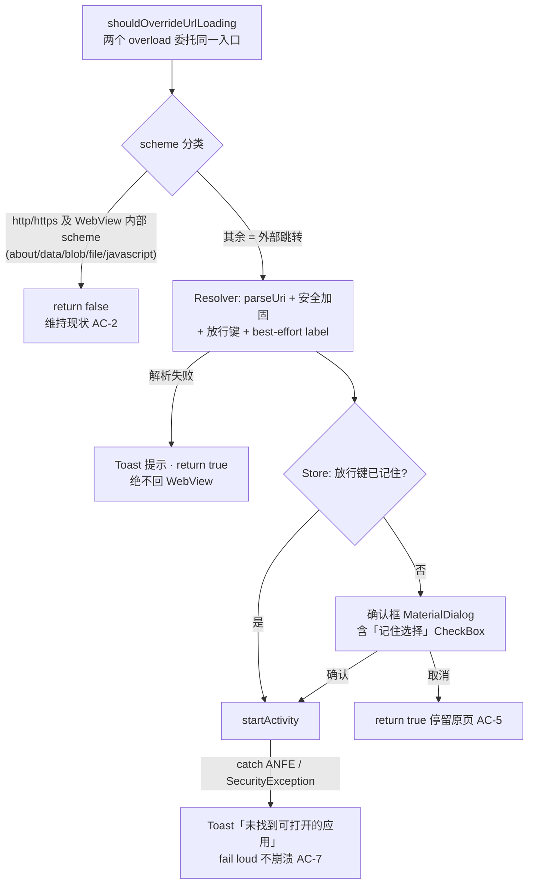

# RAS-58 · WebView 外部 App 跳转（确认框 + 记住选择）—— 技术方案

- **Owner**：技术方案官 → 开发官（实现）
- **Reviewers**：Codex（对抗式交叉评审，2 回合达成一致）、n374
- **状态**：方案定稿，待开发
- **适用范围**：LB 自有 WebView 承载面（`WebViewActivity` 及其子类）；CCT / 文章模式不在范围（见 proposal）
- **最后更新**：2026-07-17
- **上游需求**：`docs/changes/58-external-app-launch/proposal.md` · spec：`specs/external-app-launch/spec.md`

## 一句话结论

在 `WebViewActivity` 的 `WebViewClient` 补 `shouldOverrideUrlLoading`（两个 overload），把"分类判定 / Intent 解析加固 / 记住选择 / 确认框 + 启动"拆成三个可单测的小类；**未安装与否的权威判定只有 `startActivity` + catch**（targetSdk 35 包可见性下禁止用 PackageManager 预解析做拒绝门控）；`EmbeddableWebViewActivity`（气泡）为空子类，继承即覆盖。

## 架构

新增三类（`browsing/webview/` 下，Kotlin），职责单一、均可脱离 Activity 单测：

| 类 | 职责 |
|---|---|
| `ExternalAppLinkResolver` | 纯逻辑：URL 分类（透传/外跳）、`Intent.parseUri` + 安全加固、放行键计算、best-effort label |
| `ExternalAppLaunchStore`（或扩展 `Preferences`） | 「记住选择」allowlist 读写 |
| `ExternalAppLaunchHandler` | 串联：查 Store → 弹确认框 → `startActivity` + 异常兜底；持有同页去重状态 |

## 关键变更点

### 1. 拦截入口（`WebViewActivity.kt:142-155` 的匿名 `WebViewClient`）

- 同时 override **deprecated String 版**与 **`WebResourceRequest` 版**（API 24+），委托同一处理函数——minSdk 23 必须保留 String 版，不依赖框架默认转发。
- **不做 `isForMainFrame` 短路**（评审回合裁决）：官方语义下非 http(s) 的 subframe 导航同样回调本方法，H5 收银台等真实场景在 iframe 内发起 scheme 跳转；且 String 版无 frame 信息，短路会造成 API 23 与 24+ 行为分叉（跨路径差分缺陷）。滥扰风险由「同页去重 + 记住选择」兜底。
- 分类规则：`http`/`https` → `return false`（AC-2）；`about:`/`data:`/`blob:`/`file:`/`javascript:`/`content:` 等 WebView 内部 scheme → `return false` 维持现状（`content:` 为开发阶段交叉评审补充——WebView 原生可加载 content URI，Chromium 亦不将其外部化）；**其余一律 `return true`**（AC-1，即使解析失败也不得回给 WebView 加载）。
- `EmbeddableWebViewActivity` 是空子类（`EmbeddableWebViewActivity.kt:26`），改父类即同时覆盖气泡承载面；`ArticleActivity` 用 RecyclerView 渲染不涉 WebView，不接入（`ArticleActivity.kt:319`）。

### 2. Intent 解析与安全加固（Resolver）

- 统一 `Intent.parseUri(url, Intent.URI_INTENT_SCHEME)`，catch `URISyntaxException` → 提示 + `return true`。
- 加固（对齐 Chromium ExternalNavigationHandler 惯例，防网页借 `intent://` 提权）：
  - `addCategory(CATEGORY_BROWSABLE)`；
  - `component = null`、`selector = null`（禁显式指定组件，让系统做 exported 校验）；
  - 清除 `FLAG_GRANT_READ/WRITE/PERSISTABLE/PREFIX_URI_PERMISSION`；
  - 从 Activity context 启动，不加 `FLAG_ACTIVITY_NEW_TASK`。

### 3. 包可见性与"可唤起"判定（本方案正确性核心，含 spec 修正）

- 现状 manifest `<queries>` 仅声明 http/https VIEW、CustomTabsService、SEND（`AndroidManifest.xml:57-78`）。targetSdk 35 包可见性过滤下，对任意自定义 scheme 的 `resolveActivity/queryIntentActivities` 结果**不可靠**（已安装也可能解析不到）。
- **裁决（评审一致）**：预解析的否定结果**禁止**作为"未安装/不可打开"的拒绝门控——否则已装微信但 scheme 不可见时会被误告"未安装"，把错误当事实交付（正确性缺陷）。`startActivity` 不受包可见性限制（官方语义），**"能否唤起"的唯一权威信道 = `startActivity` + catch `ActivityNotFoundException`**。
- `resolveActivity` 仅 best-effort 取目标 App label 供确认框展示；取不到（或结果可能是系统 resolver）时文案退化为 scheme/包名，**不承诺精确目标 App**（措辞："网页想打开外部应用：{label|scheme}"）。
- 不引入 `QUERY_ALL_PACKAGES`（Play 政策风险）；不为门控目的扩 `<queries>`（评审中对 scheme 通配符支持与否存在事实分歧，未独立验证，但**不影响结论**：无论 queries 覆盖度如何，预解析都非权威信道，易与启动路径产生行为分叉）。
- **spec 同步修正**：spec「术语-可唤起」与 AC-3 原以"PackageManager 能解析到组件"定义可唤起，与上述裁决冲突，已随本 design 修订 spec（确认框对解析不到 label 的外跳链接同样弹出，未安装由 AC-7 兜住）。

### 4. 确认框（Handler）

- `MaterialDialog.Builder`（0.9.6.0，`build.gradle:127`；用法样板 `Changelog.java:85-92`）：标题 + 正文（弱化措辞见上）+「跳转」「取消」+ 记住选择勾选。
- 勾选项实现**优先 `customView` 内放 `CheckBox`**（仓库已有 customView 模式，0.9.x `checkBoxPrompt` API 存在性留待开发阶段编译验证，属低风险待办）。
- 生命周期保护：弹框前检查 `isFinishing || isDestroyed`，防 WindowLeaked。
- 防轰炸（开发阶段交叉评审修订）：Handler 持内存级"**弹框 pending 中**放行键"集合——同 key 弹框显示期间的重复触发（重定向链轰炸）不再弹框；**弹框关闭（确认/取消/点外部）即移除 key**，用户此后的主动点击会重新弹框。原"同页去重到页面生命周期"方案会把取消后的合法点击静默吞掉（无弹框/无启动/无提示，违反 AC-3/AC-5 的 fail-loud 语义），已废弃。`onPageStarted`（仅主 frame 加载触发）时清空兜底。
- 「记住选择」**只记"允许"，不记"拒绝"**——防用户误勾后某类链接被长期静默禁用。

### 5. 记住选择存储（Store）

- `Preferences.java`（Dagger 单例，`Preferences.java:47,99-102`）新增 StringSet 键 `external_app_launch_allowed_keys` 与 `isExternalAppLaunchAllowed(key)` / `rememberExternalAppLaunch(key)` / `clearExternalAppLaunchChoices()`。
- **StringSet 必须 copy-on-write**（`getStringSet` 返回值不可原地改，Android 已知坑）。
- 放行键粒度：`package:<目标包名>`（`intent://` 常带 package）优先 → 无包名时 `scheme:<小写 scheme>` 兜底。不含站点维度（同一 App 跨站点反复问 + 存 host 有隐私负担）。
- 清除入口：本期只做 `Preferences` API，设置页 UI 留后续（若做，放 Browsing Options 的 Behavior 区）。

### 6. 未安装 / 异常路径（AC-7 正确性红线）

- `startActivity` catch **`ActivityNotFoundException` 与 `SecurityException`**（外部网页构造的 Intent 可能指向权限保护组件，只 catch ANFE 会从 fail loud 变成崩溃）→ Toast「未找到可打开此链接的应用」（strings.xml 新增精确文案，不复用含糊的 `unxp_err`）+ log。不崩溃、不静默。
- 本期不做 `browser_fallback_url` / `market://` 兜底（用户已拍板取舍）；catch 分支收敛为单独方法，后续迭代只改一处。未安装的系统默认表现按 spec 实测项在开发/验收阶段留证。

## 影响面与回归（AC-8）

改动面收敛为：`browsing/webview/`（WebViewClient + 3 个新类）、`settings/Preferences.java`（追加方法）、strings.xml / dialog 布局。**CCT 链路（`browsing/customtabs/`）零改动**；http(s) 透传由分类第一分支保证，现有 `onPageStarted` toolbar/详情逻辑不动。回退方式：拦截函数对非 http(s) 直接 `return false` 即恢复现状。

## 测试设计

单测（Robolectric 4.3 / `@Config(sdk=[23])`，样板 `WebViewConfiguratorTest.kt:40-57`）：

| 对象 | 必测点（映射 AC） |
|---|---|
| Resolver | http/https/内部 scheme 透传（AC-2）；`intent://`、`weixin://`、`mailto:` 判外跳（AC-1）；畸形 `intent://` 解析失败不抛且仍拦截；加固断言（component/selector 置空、BROWSABLE、grant flags 清除）；放行键（带 package → 包名，否则 scheme） |
| Store | remember 后命中、clear 后不命中、copy-on-write |
| Handler | 已记住 → 直接启动不弹框（AC-6）；未记住 → 弹框；取消不启动（AC-5）；启动抛 ANFE/SecurityException → 不崩且有提示回调（AC-7，**异常路径必测，happy-path 全绿≠通过**） |
| WebViewClient | 两个 overload 对同一 URL 行为一致（防跨路径分叉） |

手测/模拟器（开发阶段留证）：确认框展示与取消停留、确认唤起已装 App（AC-4）、记住免打扰、卸载后触发的系统实际表现（spec 实测项 1）、气泡承载面一致生效、CCT 回归、普通网页浏览无感知。

## 风险与取舍

| 风险 | 等级 | 处置 |
|---|---|---|
| 预解析被误用作门控（回归引入） | 高/正确性 | 本 design 显式禁止；单测锁定"解析不到仍弹框/仍可启动" |
| 重定向链自动触发弹框打扰 | 中 | 同页去重 + 记住选择缓解；不引入用户手势门控（String 版无手势信息，会造成版本行为分叉，且误杀合法 JS 跳转）——已知取舍 |
| MaterialDialog 0.9.x checkBoxPrompt API 不确定 | 低 | customView + CheckBox 为既定路径，无阻塞 |
| 恶意页借「记住」复用信任 | 低 | 键按包名/scheme 且仅记"允许"，首次必经用户确认 |

## 评审记录（对抗式，2 回合，已达成一致）

- 双方独立产方案后交叉评审。**回合内裁决的实质分歧**：① Codex 原方案"补 `<queries>` + PackageManager 预解析拒绝门控"被判正确性缺陷，Codex 接受修正（权威判定改 `startActivity`+catch）；② Codex 原 `isForMainFrame` 短路被判会漏 iframe 场景且造成 overload 行为分叉，Codex 接受删除；③ Codex 指出 CC 方案只 catch ANFE 不够（漏 SecurityException，高）、单 Delegate 类过胖（中，改三类拆分）、label 文案过度承诺（中），CC 均采纳；④ 双方补强：Activity 生命周期保护、同页去重、只记允许不记拒绝。
- 遗留的事实分歧（不影响结论）：`<queries>` scheme 通配符是否被官方支持——未独立验证，design 不依赖该事实。
- **结论：双方通过合并方案。**

## 变更历史

- 2026-07-17 技术方案官：产出 design（含 Codex 对抗评审 2 回合共识），同步修正 spec「可唤起」定义与放行键粒度，转开发阶段。
- 2026-07-17 开发官：开发阶段交叉验收（Codex）修订两点——① 去重语义从"同页生命周期"改为"弹框 pending 期间"（原方案会静默吞掉取消后的合法点击，AC-3/AC-5 违例，高severity 采纳）；② WebView 内部 scheme 白名单补 `content:`（维持现状行为，中 severity 采纳）。
